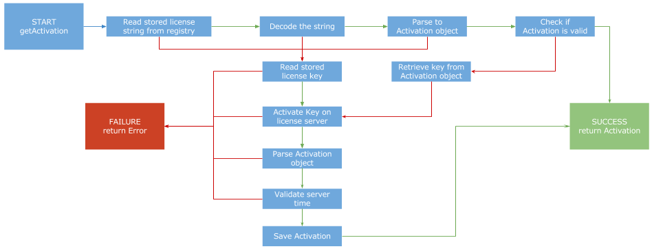

# An option type in C# #

## Abstract

If you’ve been programming C# you’ve probably shouted at your screen because of a NullReferenceException at some point in the past. This usually happens because some method returned null when you weren’t expecting it and thus did not handle that possibility in your code. Null is often (ab)used to represent absent or optional values, which makes unexpected exceptions even more likely. But there’s a better way: an option type!
It’s a strongly typed alternative to null values that not only lets you avoid NullReferenceExceptions but also declare your intent and write more focused code.
I’ll give you an overview of this awesome concept and how to use it even though C# does not have a built-in option type.

## Intro

So, what is this option type?

An **option type** is a generic type that can encapsulate an optional value. In other words, it's a container that may or may not contain a value.
A lot of functional programming languages have option types build in, like F#, Scala or OCaml. In some other languages like Haskell it's called **maybe**, but the concept is the same.

It's very useful for example as a return value for a function, that could return a missing or invalid value.

Here's an example from F#:

```fsharp
type Option<'t> =
   | Some of 't
   | None

 let someValue = Some 1
 let noValue = None

 match someValue with
 | Some x -> printfn "the value is %A" x
 | None -> printfn "the value is None"
```

`Option<T>` is a container for an optional value of type `T`. If the value is present, `Option<T>` is an instance of `Some<T>`, which contains the given value. If there is no value, then `Option<T>` is `None`.

In F#, Option replaces null almost completely!

### Why would I do that?

Using an option type has a few advantages over null. But before continuing with that let's look at what C# offers us out of the box.

## What about null and Nullable?

So, what exactly is null again? According to [MSDN](https://msdn.microsoft.com/en-us/library/edakx9da.aspx):
> The null keyword is a literal that represents a null reference, one that does not refer to any object.

### Null and type safety

The problem with null is, that is has the same type as the object it could be referring to. This means the type system doesn’t tell you when you have null.

```csharp
string s1 = "abc";
int len1 = s1.Length;

string s2 = null;
int len2 = s2.Length;
```
While the above code obviously produces an exception, the compiler doesn't prevent me from making that mistake. The "null string" appears to have all the same properties and functions as the valid string, except that your code will blow up when you try to use it!

The same wouldn't be possible with an option type: `Option<string>` is of type `Option` and not `string`, so the compiler will prevent me from accidentally accessing the `Length` property on a non existing value! You won't be able to do that until you've *safely* extracted it and *made a choice* about what to do.

### Null vs missing data
As stated above, null in C# represents a reference that doesn’t point to anything. This is completely different from the concept of “missing” data, which is a valid part of modelling any system in any language. Null is often used to represent missing data though.

### Option vs Nullable
The basic idea of an option type and Nullable (see [MSDN](https://msdn.microsoft.com/en-us/library/1t3y8s4s.aspx)) is the same, only Nullable is much weaker. It only works on value types (like `int` or `DateTime`), but not on reference types such as strings or classes. Nullable also doesn't provide much special behavior.

### Null checking in C# #
C# provides a lot of convenience operators when it comes to null values:
```csharp
string s1 = null;
var length = s1 != null ? s1.length : 0;
var length = s1?.length ?? 0;
```

The `??` operator is called null-coalescing operator. It returns the left-hand operand if the operand is not null; otherwise it returns the right hand operand.

The `?.` operator is called null-propagation operator and allows for null checks within invocation chains. It will short-circuit and return null if anything in the chain is null.

These two operators are great and make null checks much easier! However, you are screwed if you forget to use this operator, and nothing forces you to do so. Hello, unexpected NullReferenceException!

## Option to the rescue!

As I've indicated in the beginning, an option type is a much better way to represent optional or invalid data than null or Nullable are.

Using option instead of null to model missing or invalid data cuts down on manual null checks, which simplifies the control flow of your program, but that's not all. It also avoids null checks you're forgetting to do, which would lead to a runtime exception! The type signature will tell you if a value is optional and require you to handle the case where the value is missing.

And when you write functions that return options instead of a value that could be null, you also make the behaviour explicit and again force the caller to handle both cases.

Alright, that sounds awesome but we're still writing C# and not F#...

### An option type in C# #

And although C# does not bring it's own option type, there are smart people who implemented it and provide us with a robust and well tested library!

https://github.com/nlkl/Optional

### Optional
The Optional library provides a strongly typed alternative to null in C#. It's easy to use and has lots of cool features:

First and foremost it provides an implementation for **Option/Maybe** and **Either**

The option/maybe type behaves similar to the functional programming concept we've talked about: `Option<T>` can be `Some<T>` when a value `T` exists or `None` if it doesn't.

The either type is similar, but instead of `None` it provides another *exceptional* value indicating why there is no value or why an operation regarding the optional value failed.

In addition to that, the implementation prevents 'unsafe' access to the internal value of an `Option<T>`. It forces the user to check if a value is actually present, thereby mitigating many of the problems of null values.
You can still retrieve the value directly if you want to (whether it's there or not), but you need to explicitly state that you want to access it in an unsafe way, it can't sneak in by accident.

The library provides a lot of utility methods to make working with the option type more convenient. The most noteworthy feature that makes this implementation of the option type so great is the possibility to treat the option type like a collection with zero or one values. It's possible to apply map and filter functions to the value **without ever unpacking it from it's `Option` container**! I didn't realize how great this is until I actually implemented it in a bigger project. 

## Example

To demonstrate the benefits of using Optional I create a small example project. It is inspired by a real-world project where Optional helped me write simpler and more robust code.

The function I implemented represents part of the licensing logic of an application. It is called `GetActivation()` and it tries to retrieve a valid activation to check if the application can start. First, it checks if a valid activation is already stored on the computer. If it finds one, it just returns it. If there is no stored activation or if the stored activation is not valid for some reason (maybe it expired or is corrupted) it tries to find a license key and activate it by contacting the license server.
A more detailed representation of the process is displayed in the diagram below.




## Conclusion
// TODO
"It’s not that dealing with any given instance of null is particularly hard, it’s that it is so easy to miss one. Removing this concern and encoding the information in the type system means programmers have less things to keep track of and simplifies control flow across the entire program. When you don’t have to keep track of it manually it is just plain easier to write code. More importantly, it is easier to write more robust code. "

You can still choose to do the equivalent of if (null) return; and some examples will do that, because it makes sense to do in some contexts. What matters is that Maybe forces you to think about it at the time of writing the code, and to be explicit about it.
Instead of you being notified when things go wrong, Maybe forces you to think things through in the first place and make an explicit choice about what to do (at least as far as possibly empty values are concerned).

Extract unsafe: So, it is possible to shoot yourself in the foot if you want to. The difference is you have to explicitly ask for this behavior, it cannot sneak in by accident.

Of course option in C# is not as useful als in F#: can’t eliminate null. Still provides loads of benefits over null when dealing with optional values / Missing, invalid data!
